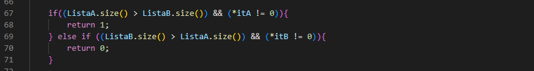

# Algoritmo BigNumbers
> Na matéria de Laboratório de Algoritmos vimos como utilizar - de forma rápida e simples - números inteiros gigantes que tem seu manuseio complexo e complicado, isto é, os big numbers, consequentemente estudamos também as suas operações, sendo elas: adição, subtração, multiplicação e vezes 10. E para a pratica e compreensão de mais um conteúdo passado em sala, utilizamos o uso do tempo de execução - clock.

## :computer: Desenvolvimento do código
>Para melhor compreensão do algoritmo iremos explicar o código por completo como foi desenvolvido, mostrando as possíveis saídas e como chegamos a tais resultados demonstrando com imagens.

Iniciamos o algoritmo colocando as bibliotecas e declaramos as funções que iremos utilizar no código, sendo elas: printNumber(função que será impresso a resposta), maiorMenor(função que determina o maior e menor vetor para auxiliar a operação de subtração), soma, subtração e multiplicação(funções das operações básicas entre os vetores) e vezes10(operação que multiplica o vetor 10 vezes, seja o primeiro valor ou o segundo).

---

### :hammer_and_wrench: Main
Na Main é criado as variáveis e impresso os resultados, é a parte básica e inicial do código, dessa forma, começamos criando duas listas que denominamos de A e B, após isso é criado dois vetores com os números gigantes(big numbers) separando cada número por virgula e seguinte a isso é criado dois FOR que irá percorrer o vetor verificando seu tamanho e também colocando os valores na lista que criamos, ficando assim lista A = V1, e a lista B = V2. Também é inicializado o tempo de clock.

Por fim é criado as variáveis que serão impressas e chamada as funções, na qual irá sair na tela ao compilar.

### **:heavy_plus_sign:** Operação de adição
No processo de soma entre dois big numbers cada número ocupa um vetor. É necessário, no entanto, o preenchimento por inteiro de cada índice do vetor de baixo para cima, a fim de que os elementos da soma, correspondente a cada algarismo, se encontre devidamente ordenado. 
Por exemplo, na soma dos dois big numbers abaixo, a posição dos elementos devem estar organizados da direita para a esquerda para que a soma seja efetivada. Ou seja, percorrendo o vetor de trás para frente, é preciso que o elemento 5 do vetor V2 ocupe o índice equivalente a mesma posição do elemento 2 no vetor V1.

A função de soma irá preencher a lista para que ambos os vetores interajam sobre a mesma quantidade de posições. Nesse sentido, enquanto uma lista for menor que a outra será inserido o elemento zero uma posição à frente na lista menor, no caso do exemplo será alocado seis números zeros à esquerda na ListaB, correspondente ao vetor V2:

Depois desse primeiro passo a soma propriamente dita se inicia. A princípio, é armazenado os dois últimos valores de cada lista, respectivamente, como é mostrado abaixo:

Posteriormente, a soma entre os elementos das listas será realizada sucessivamente, da direita para a esquerda, até o índice zero. 
Para os casos em que a soma entre dois valores seja maior que 9 o “vai 1” ocorre. Dessa forma é atualizado o valor para guardar o número 1 que será somado com os números à sua frente na próxima execução. 
No fim da execução a soma completa é retornada.

### **:heavy_minus_sign:** Operação de subtração
Na operação de subtração, sabemos que é feito a diminuição dos valores da direita para a esquerda, sendo eles ordenados de trás pra frente, da seguinte maneira: o último valor do V1 irá subtrair com o último valor do V2, ou seja, os valores devem estar ordenados da maneira que os índices de trás para frente estejam na mesma posição, e assim para auxiliar essa operação foi feito uma função de maiorMenor, para que possamos concluir a operação de subtração com sucesso.
#### **:arrow_up_down:** Operação de menorMaior
De inicio, começamos criando variáveis como iterador para que possamos "correr" nos vetores elemento a elemento e assim é possível realizar as operações necessárias, após isso, utilizamos nas variáveis criadas fazendo interligação com os vetores, a função begin(), que retorna um iterador apontando para o primeiro elemento dessa lista.

Em sequência, para verificar qual o maior valor, é criado um IF e ELSE, fazendo essa comparação, da seguinte forma: se o primeiro elemento da ListaA for maior que o primeiro elemento da ListaB e esse for diferente de 0, o IF irá retornar o valor 1 e se ocorrer o contrário o IF irá retornar valor 0, dessa forma, na função de subtração é mais fácil e rápido, saber qual o maior para poder da continuidade na mesma.

Porém o primeiro elemento de ambas listas podem começar igual, dessa forma, para que não ocorra erro é criado um FOR que irá verificar elemento a elemento com o mesmo sentido, se o elemento *intA for mais que o *intB irá retornar 1 senão irá retornar 0, logo após, é feito o acréscimo dos valores de cada iterador atualizando e percorrendo para que corresponda os demais número de cada lista. Para finalizar é retornado o valor 2, caso as listas sejam iguais.

Decorrente a isso, podemos enfim dar inicio a operação de subtração, declarando os iteradores e variaveis, é necessário criar um WHILE que irá executar enquanto o tamanho das listas forem diferente, para que assim ambas interagem com a mesma quantidade de posições, dessa forma, dentro dele é criado um IF e ELSE sendo: se a ListaA for menor que a ListaB, é colocado 0 na frente do vetor da ListaA, se não é colocado o 0 na frente do vetor da ListaB, até que ambos tenha a mesma quantidade de elementos.

Utilizando agora a função menorMaior, é criado uma variável para chamar a mesma e assim com o seu retorno, é possível verificar: se ord for igual a 1, então quer dizer que a subtração desses elementos(no caso o ultimo da lista) pode ocorrer da maneira que os números estão ordenados, se não, é preciso realizar a troca das listas, e consequentemente de seus elementos, após o IF é feito o decremento do iterador para que as comparações ocorram em todos os elementos das listas, e é com a função .end que essa comparação é realizada a cada iteração, começando do final da lista até sua primeira posição, sendo ela demostrada dentro do IF.

Para finalizar, com as listas do mesmo tamanho, é feito um FOR para executar a subtração elemento a elemento, enquanto o valor de i é menor que a ListaA, dessa forma, é criado as variáveis x e y na qual ocorrerá essa iteração, sendo x o valor do iterador1 e y o valor do iterador2, iteradores esses que estão tendo seus valores capturados dos vetores(iniciando do fim) respectivamente. 
Na subtração temos que considerar um ponto: as vezes será necessário pegar um valor emprestado, que virar em forma de dezena para o elemento que está precisando, mas para quem emprestou será retirado apenas uma unidade.
Sabendo disso definimos a variável cont que será responsável por guardar o valor que será reduzido na subtração, esse valor será dado a partir de um operador lógico, se o valor de aux for 10, o valor de cont será 1, caso contrario será 0. Em primeira instancia esse valor é 0, e poderá mudar caso o valor de aux tenha mudado para 10.
Agora temos a variável aux, que irá receber o valor 10, caso o operador lógico esteja verdadeiro ou 0 se estiver falso. A operação lógica que irá regrar a variável será: se o valor de ((x - cont) - y) for menor que 0 significa que o "x" precisa de uma ajuda pra subtrair com y, é nessa hora que iremos acrescentar a dezena.
Fazendo a subtração, no caso em que o "x" é menor que "y" e aux estiver definido como 10, a subtração irá ocorrer da seguinte forma, "x" será subtraído pelo cont e somado com aux e após isso será subtraído por y, em contrapartida o outro caso ocorre quando aux não é 10, assim, a subtração é bem mais simples: "x" será subtraído por cont e depois por y.

Os resultados das subtraçãos é armazenado na variável S, que é inserido a frente da Lista com a função push_back. Dessa forma, é feito também o decréscimo dos iteradores para que a subtração continue corretamente. Para que a impressão saia com o resultado correto, na qual, a ListaA for menor que a ListaB, é feito um printf com o simbolo de "-" identificando que a subtração é negativa e por fim a função retorna o S.

### **:heavy_multiplication_x:** Operação de multiplicação
Na função de multiplicação, após a declaração das listas e variáveis necessárias, será armazenado a quantidade de posições, ou seja, o tamanho necessário do vetor para que a operação se efetue:

Logo após, de forma análoga ao processo da soma, o decremento é realizado e o valor de cada um dos interatores é atualizado para que corresponda ao último número de cada lista, respectivamente:

Depois disso, a cada multiplicação que se encerra a contabilização da quantidade de casas da direita para a esquerda é realizada. Isso ocorre em relação ao tamanho da menor lista. Esse raciocínio será expresso pelo seguinte código:

No código acima o último elemento da ListaB será multiplicado, de trás para frente, com todos os outros elementos da ListaA. Logo em seguida esse mesmo processo ocorrerá com a penúltimo elemento, e depois com o antepenúltimo até o fim da lista, posição [0]. O i será contabilizado a cada final do processo.
A cada fim de linha, ou seja, depois de cada multiplicação individual será necessário pular mais uma casa à esquerda. Nesse sentido, o valor zero deverá ser inserido de acordo com o valor do contador “j” evidente no código abaixo. Dessa forma, para cada j = i, um elemento zero é introduzido:

Posteriormente, a multiplicação propriamente dita entrará em execução. A variável “multi” armazena o valor real da multiplicação. Caso o resultado dessa multiplicação seja um número com mais de um algarismo esse valor é dividido por 10 para que a variável “aux” armazene o valor que deverá ser somado, caso contrário, nenhum valor é somado na próxima multiplicação.

O valor da lista Aux1 é inserido uma casa à esquerda para que seja somado com o resultado da multiplicação que virá logo à frente. itA- - insere o último dígito correspondente ao resultado da multiplicação e a cont++ é atualizada para que cada operação só seja efetuada enquanto o contador for menor que o tamanho da lista:

Terminando esse processo, é preciso verificar se a variável “aux” possui algum valor diferente de zero armazenado. Se porventura esse valor exista, deverá ser alocado na casa à frente na lista Aux1, correspondente ao índice zero:

O resultado da multiplicação completa referente aquela respectiva linha é armazenado na lista “Result”. O contador é atualizado para zero com a finalidade de recomeçar a contagem a partir da multiplicação em relação a um novo número do vetor. itB- - pula uma casa à esquerda na ListaB, assim, inicia-se uma nova multiplicação.
Por fim o resultado geral, proveniente da soma de todas as multiplicações, é retornado:

### :heavy_multiplication_x: :keycap_ten: Operação de vezes 10
A operação mais simples do exercício, porém, não menos importante, de maneira análoga, sabemos que ao multiplicar qualquer número por 10, essa multiplicação ocorrera apenas o acrescentado do zero ao final desse número, com essa lógica foi possível realizar no código o mesmo sentido, onde iremos pegar a Lista com os valores, com a função push_back(0) é inserido ao final da Lista um número 0 e de certa forma realizado a multiplicação, por fim é retornado o novo valor.

### :memo: Possível Saída

---