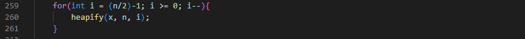
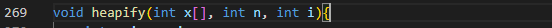
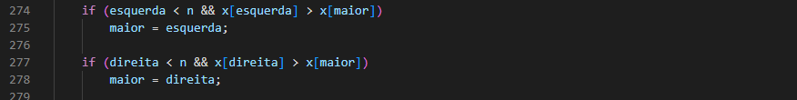

# Algoritmo de Ordenação
> Na matéria de Algoritmos e Estrutura de Dados I foi desenvolvido e ensinado a como mexer nos algoritmos de ordenação como forma teórica e prática, algoritmos de ordenação nada mais é que uma forma de organizar um vetores/lista de números aleatórios, a  depender do código. Dessa forma, para realizar a atividade escolhemos os seguintes algoritmos para desenvolver: BubbleSort, MergeSort, QuickSort, InsertionSort, SelectionSort, CombSort, ShellSort e HeapSort. Em meio as aulas foi ensinado a mexer com GNU plot, assim, para exemplificar a comparação entre eles foi realizado o funcionamento do mesmo, criamos gráficos sobre os 8 algoritmos.

## :computer: Desenvolvimento do código "numerosAleatorios.cpp"
>O código tem o objetivo de criar sequências de números inteiros aleatórios para serem ordenados pelos métodos de ordenação. O algoritmo recebe alguns parâmetros para que os números sejam o máximo possível divergente entre os elementos, criando assim, sempre listas/vetores de números diferentes. Além disso, o código apresenta algumas funções para uma melhor visualização dos números presentes no vetor. Uma delas é a escrita desses números em um arquivo .txt,

**:1234:** Para a implementação do arquivo de números aleatórios é formado três funções que criam e auxiliam na visualização desses números para serem ordenados pelos algoritmos de ordenação. Sendo elas:

### int* numerosAleatorios(int, int);
Essa função tem como propósito a criação de uma sequência de números inteiros com tamanho N. Além disso, para garantir uma maior variedade de números, é utilizado a função rand(), que tem como objetivo gerar esses números aleatórios, junto com algumas parâmetros para uma distinção dos inteiros. Por fim é retornado x(os números aleatórios.)

### void mostrarSequencia(int*, int);
A segunda função é a mostrarSequencia dentre as que foi implementada esta é a mais básica, pois o objetivo dela é apenas de imprimir a sequência criada dos números no console, ou arquivo, após ser chamada.

### void escreverEmArquivo(int* x, int);
A ultima função, foi desenvolvida para registrar os números aleatórios que foram gerados e que serão ordenados pelos algoritmos de ordenação. Nessa função, utilizamos a manipulação de arquivos para escrever os números um a um por meio de um FOR no arquivo .txt.

## :computer: Desenvolvimento do código "ordenacao.cpp"
**:warning:** Obs.: Dentre os 8 algoritmos de ordenação abordados, as explicações referentes ao desenvolvimento dos códigos nas funções bubbleSort, mergeSort e quickSort não foram detalhadas pelo motivo de já terem sido explanadas em aula pelo professor. O mesmo serve para as outras implementações fornecidas, responsáveis por tornar possível a execução final dos algoritmos, como as funções main, lerDados e mostrarValores.

### Insertion Sort
O objetivo do Insertion Sort é seguir uma ordenação de forma crescente/construtivamente enquanto faz as comparações, onde a cada interação com um número, colocando-o em seu lugar.
A lógica por trás do algoritmo se inicia com um FOR, que vai percorrer todo o vetor/lista. Inicialmente é selecionado o número – denominado de aux – que será comparado com seu anterior – x[j].

Após isso, é usado um WHILE para fazer a comparação e caso o número comparado seja menor e valor de J for positivo, é feito um swap (troca entre os elementos), seguindo é feito um decréscimo em j, que corresponde ao índice do vetor, com o intuído de fazer novamente uma comparação anterior ao que já foi feita a comparação e troca. Agora caso, o número x[j] for maior, o WHILEé interrompido ou mesmo ele nem entra no WHILE.

Caso o WHILE seja interrompido/finalizado é feita uma ultima troca para que a ordenação se mantenha constante e para dar continuidade com o FOR.

### Selection Sort
No selection sort ocorre a seleção de um elemento do vetor. À medida que o array é percorrido os números à frente do valor selecionado é comparado.

Usando o exemplo da lista acima, o número 241 é o primeiro elemento do vetor, ocupando a posição x[0], enquanto a posição que determinado valor ocupar for menor que o tamanho do array menos 1 (1 corresponde ao espaço ocupado por aquele elemento) o vetor é percorrido:

Para que a comparação se torne possível é preciso incrementar um pulo até o final da lista

Caso o valor determinado armazenado no índice “j” seja menor que o número anterior (retido no índice mínimo) os elementos serão trocados

É necessário também garantir a ordenação em relação ao valor das posições, para que nas próximas comparações os valores expressos anteriormente já estejam devidamente alocados

### Shell Sort
No shell sort o número ímpar de pulos evita comparações desnecessárias. Nesse sentido, na última ordenação o número de pulos precisa ser igual a 1 a fim de garantir a ordenação de toda a lista.

Enquanto os pulos forem maiores maiores que 1, o intervalo entre posições para a comparação de elementos é atualizado

Ocorre a troca de elementos caso o número contido em uma posição mais à frente seja menor do que um valor que ocupa alguma coisa posição anterior, caso contrário os valores são mantidos em suas respectivas posições

### Comb Sort
No comb sort o tamanho do vetor é contabilizado e enquanto o intervalo entre as posições ocupadas pelos elementos for diferente que 1 a ordenação é realizada

Enquanto a condição for satisfeita, o tamanho do vetor é dividido por 1.3. Caso o intervalo entre posição seja menor que 1 não será possível fazer comparações

A partir do resultado da divisão entre o tamanho do vetor por 1.3 é que a ordenação irá acontecer. Ou seja, se o vetor tiver tamanho 10 o resultado inteiro da divisão por 1.3 será 7. Dessa forma, os valores a serem comparados inicialmente serão os que ocupam a primeira e a sétima posição, depois a segunda e oitava posições, terceira e nona… Depois disso, o resultado da divisão anterior (7) será dividido por 1,3 e o mesmo processo será realizado até que toda a lista fique ordenada.

### Heap Sort
O método de ordenação Heap Sort pode ser dividido em duas partes, a separação dos números em uma árvore linear – semelhante a uma árvore genealógica – e a comparação dos elementos presentes nessa árvore. Essas duas partes estão representadas em duas funções:

#### void heapsort(int *x, int n);
Essa função tem como propósito de dividir a lista e ir fazendo as comparações enquanto separa-os, semelhante como era feito teoricamente, em uma árvore.

Inicialmente a função é composta por um FOR que irá executar até que (n/2) – 1 for negativo, pois isso remete os níveis em que a árvore desce por assim dizer. Dentro desse for terá a chamada da função _heapify,_ que será responsável por comparar e fazer as trocas.

A função finaliza com um último FOR, que tem como objetivo de varrer novamente a lista fazendo as trocas necessárias e a comparação dos elementos na lista com a função _heapify_.

#### void  heapify(int  x[], int  n, int  i);
Esta função recebe como parâmetro o vetor a ser ordenado, o tamanho do vetor e um índice – que veio do FOR em que a função foi chamada.

Dentro da função, é definida algumas variáveis que serviram como índice utilizado por X, que irá representar os números do vetor, semelhante como se estivesse disposto numa arvore linear. O _maior_ representa o índice do número que está em cima, já a esquerda representa o índice do número abaixo a esquerda do maior assim como a direita.

Após a definição, é feita a comparação entre eles, caso um número que está em baixo –na esquerda ou direita – for maior que a variável _maior_, essa variável recebe o valor maior. Tal comparação é feita dos dois lados.

Por fim, caso a variável tenha sido alterada nos casos acima, esse _if_ é acionado e nele haverá a troca dos valores para manter ordenado e chamar novamente a função _heapify_ para garantir que não precisará mudar novamente o maior para ainda mais acima.

## :computer: Desenvolvimento do código "graficos.plt"
> O [GNUplot](http://www.gnuplot.info/documentation.html) é um software livre que tem função de plotar gráficos sendo eles bi ou tridimensionais. Sua utilização se da pela linha de comando com o comando plot, comando esse que irá mostrar os gráficos de determinada função ou algoritmo através de um arquivo de dados definido no GNUplot, ou criado pelo usuário. Utilizamos para a visualização o formato de arquivo .pdf.

No arquivo graficos.plt as primeiras linhas são de determinação e orientação, sendo elas:
 - set terminal pdf : formato de arquivo que irá gerar após o plot
 - set border linewidth 1.5 : define o tamanho da largura da borda dos gráficos
 - set output 'graficos.pdf' : define a saída com nome de graficos.pdf
 - set title "Algoritmos de Ordenação" : define o titulo do gráfico como Algoritmos de Ordenação
 - set xlabel "Número de pontos" : define o titulo do eixo x números de pontos e a sua quantidade
 - set logscale y : define a escala de logaritmo
 - set key inside left : define o menu de titulo a esquerda

Após essa determinação, é realizado os plot referente aos tempos.txt calculados, que irão formar as linhas no gráfico, em cada linha é definido uma cor e um nome escolhido para tais algoritmos de ordenação.

### **:chart_with_upwards_trend:** Saída

